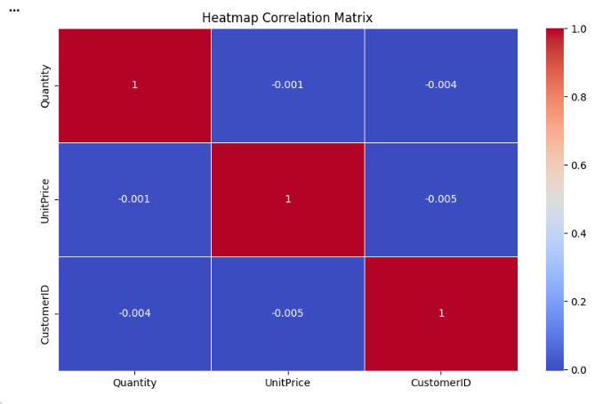
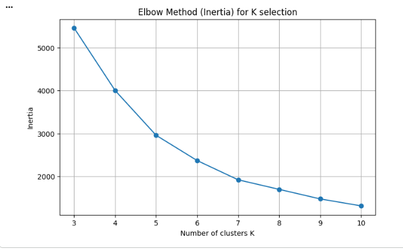
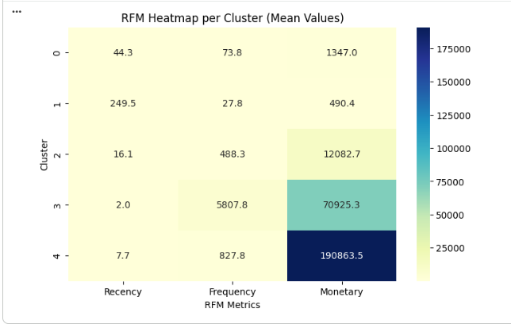
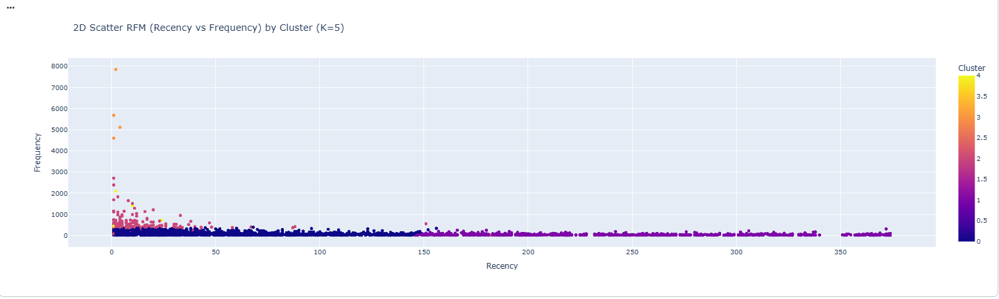
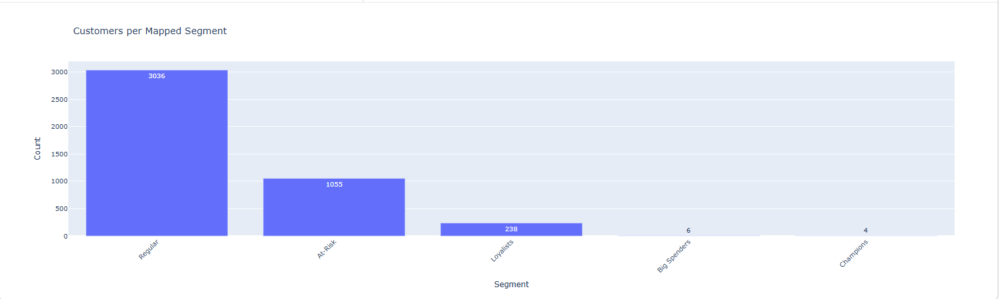

# Customer-Segmentation
Customer Segmentation for Personalized Retail Marketing


## 📋 Overview
Proyek ini bertujuan untuk melakukan segmentasi pelanggan (Customer Segmentation) pada dataset **Online Retail** menggunakan analisis **RFM (Recency, Frequency, Monetary)** dan algoritma Machine Learning **K-Means Clustering**.

Tujuan utamanya adalah mengelompokkan pelanggan berdasarkan perilaku pembelian mereka untuk membantu bisnis dalam menentukan strategi pemasaran yang lebih personal dan efektif.

## 📊 Dataset
Dataset yang digunakan adalah `online_retail.csv`. Dataset ini berisi transaksi toko online yang berbasis di UK.
* **Sumber Data:** (https://www.kaggle.com/datasets/ulrikthygepedersen/online-retail-dataset)
* **Encoding:** `latin-1`
* **Kolom Utama:**
    * `InvoiceNo`: Nomor transaksi.
    * `CustomerID`: ID unik pelanggan.
    * `StockCode`: Kode produk.
    * `Description`: Deskripsi produk.
    * `InvoiceDate`: Tanggal transaksi.
    * `Quantity`: Jumlah barang.
    * `UnitPrice`: Harga per unit.
    * `Country`: Negara pembelian.

## 🛠️ Tech Stack
Proyek ini dibangun menggunakan **Python** dengan library berikut:
* **Data Processing:** `Pandas`, `NumPy`
* **Visualization:** `Matplotlib`, `Seaborn`, `Plotly Express` (Interaktif)
* **Machine Learning:** `Scikit-Learn` (K-Means, StandardScaler, Metrics)

## ⚙️ Workflow Analisis

1.  **Data Cleaning:**
    * Menghapus baris tanpa `CustomerID`.
    * Menangani tipe data (`datetime`) dan encoding.
    * Menghapus transaksi retur/batal (`Quantity <= 0`).
    * Menghapus kolom yang tidak relevan (`Country`).

2.  **RFM Feature Engineering:**
    * **Recency (R):** Hari sejak pembelian terakhir.
    * **Frequency (F):** Jumlah transaksi unik.
    * **Monetary (M):** Total uang yang dibelanjakan.

3.  **Clustering (K-Means):**
    * Standarisasi data menggunakan `StandardScaler`.
    * Menentukan jumlah cluster optimal (K) menggunakan **Elbow Method** dan **Silhouette Score**.
    * Melatih model K-Means dengan nilai K terbaik.

4.  **Profiling & Evaluasi:**
    * Memberikan label segmen ("Big Spenders", "Champions", "Loyalists", "Regular", "At-Risk") berdasarkan karakteristik segmen.
    * Evaluasi metrik cluster menggunakan **Davies-Bouldin Index** dan **Calinski-Harabasz Score**.

## 📈 Visualisasi Hasil
Menghasilkan visualisasi penting:
* **Correlation Heatmap:** Hubungan antar variabel data mentah.

* **Elbow Curve:** Grafik untuk menentukan jumlah cluster.

* **RFM Heatmap:** Profil rata-rata R, F, M per cluster.

* **2D Scatter Plot:** Sebaran cluster berdasarkan Recency vs Frequency.

* **Bar Chart:** Distribusi jumlah pelanggan per segmen.


## 🚀 Cara Menjalankan Code

1.  **Clone Repository:**
    ```bash
    git clone https://github.com/Tikleboy/Captone_Project_Customer-Segmentation
    ```

2.  **Install Dependencies:**
    Pastikan memiliki library yang dibutuhkan. Menginstallnya via pip:
    ```bash
    pip install numpy pandas seaborn plotly matplotlib scikit-learn
    ```

3.  **Siapkan Dataset:**
    Pastikan file `online_retail.csv` berada di direktori yang sama dengan script python.

4.  **Jalankan Script:**
    Jalankan file Notebook.

## 📝 Segmentasi
Berikut adalah segmentasi dan karakteristik segmen yang digunakan:

| Segmen            | Karakteristik                                               |
| ----------------- | ----------------------------------------------------------- |
| **Big Spenders**  | Recency rendah, Frequency tinggi, Monetary sangat tinggi.   |
| **Champions**     | Baru saja belanja, sering belanja, pengeluaran besar.       |
| **Loyalists**     | Cukup sering belanja dengan pengeluaran menengah.           |
| **Regular**       | Belanja standar, jarang kembali dalam waktu dekat.          |
| **At-Risk**       | Sudah lama tidak belanja, frekuensi dan pengeluaran rendah. |
| ----------------- | ----------------------------------------------------------- |


## 👥 Author

**Capstone Tim ID : A25-CS315**

**Paulus Ferdinand Stanly Lopez - M891D5Y1563**

**Wahyu Ramadhani - M891D5Y1951**

**Eka Fanya Yohana Dasilva - M401D5X0523**
